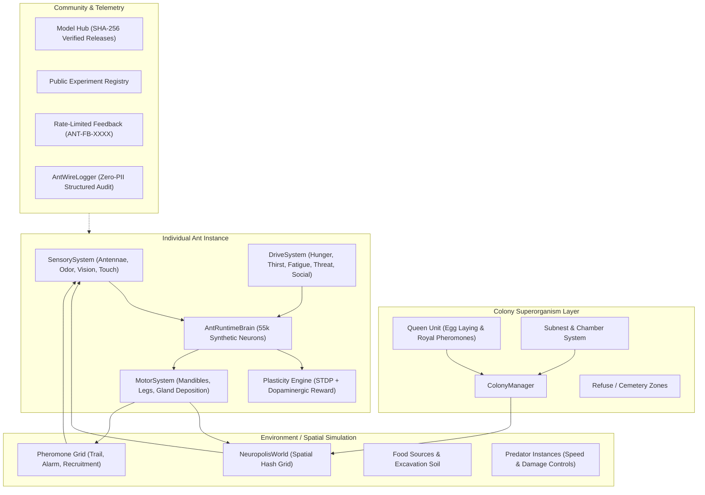
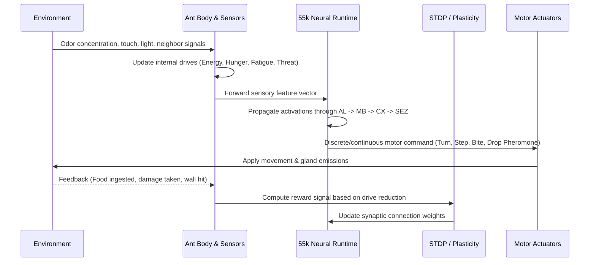

# AntWire Complete System Walkthrough & Developer Guide

> **AntWire**: An extensible, biology-grounded computational ant brain (~55,000 synthetic neurons), individual-ant runtime, multi-agent colony superorganism, and open-source simulation platform.

---

## Table of Contents

1. [System Overview & Philosophy](#1-system-overview--philosophy)
2. [High-Level Architecture](#2-high-level-architecture)
3. [The Individual Ant Brain & Runtime Loop](#3-the-individual-ant-brain--runtime-loop)
4. [55,000-Neuron Connectome Architecture](#4-55000-neuron-connectome-architecture)
5. [Colony Superorganism Dynamics](#5-colony-superorganism-dynamics)
6. [Extensibility: Adding New Tasks & Environments](#6-extensibility-adding-new-tasks--environments)
7. [Step-by-Step Developer Workflows](#7-step-by-step-developer-workflows)
   - [Workflow A: Running the Application & Tests](#workflow-a-running-the-application--tests)
   - [Workflow B: Inspecting Live Neural Activity & Why Decisions Occur](#workflow-b-inspecting-live-neural-activity--why-decisions-occur)
   - [Workflow C: Building a Custom Ant Task in Code](#workflow-c-building-a-custom-ant-task-in-code)
   - [Workflow D: Tuning Predator Threat & Swarm Defense](#workflow-d-tuning-predator-threat--swarm-defense)
   - [Workflow E: Publishing Public Experiments & Verifying Models](#workflow-e-publishing-public-experiments--verifying-models)
8. [Live Trained Showcase](#8-live-trained-showcase)
9. [Security, Privacy, and Truthful Data Invariants](#9-security-privacy-and-truthful-data-invariants)
10. [Authorship & Citation](#10-authorship--citation)

---

## 1. System Overview & Philosophy

AntWire models emergent intelligence from biological ground truths:

1. **Isolated Runtime State**: Each ant is an autonomous agent with its own private 55,000-neuron activation state, synaptic weights, drives, sensory inputs, working memory, and physiological parameters (energy, hydration, starvation stress).
2. **Immutable Shared Models**: Ants share the immutable `.antbrain` neural architecture and immutable environment rules, but *never* share mutable neural activation or memory buffers.
3. **Superorganism Emergence**: Colony-level coordination (food foraging trails, cemetery formation, subnest excavation, queen protection, trophallaxis) emerges purely from local agent-to-agent interactions and chemical pheromone diffusion.
4. **Strictly Truthful Data**: No fabricated download counters, fake benchmarks, or dummy comments. If data is unmeasured, the platform explicitly reports `No data available` or `Not measured`.

---

## 2. High-Level Architecture



---

## 3. The Individual Ant Brain & Runtime Loop

Every ant executes a closed cognitive-action cycle on every simulation tick (60 Hz):

$$\text{SENSE} \longrightarrow \text{INTERNAL STATE} \longrightarrow \text{MEMORY} \longrightarrow \text{EVALUATE} \longrightarrow \text{DECIDE} \longrightarrow \text{ACT} \longrightarrow \text{RESULT} \longrightarrow \text{REWARD} \longrightarrow \text{LEARN}$$



### Cognitive States

An ant never gets stuck in infinite aimless exploration. Its task transitions follow a biological priority state machine:

```text
NEST ──> EXPLORE ──> DISCOVER ──> EVALUATE ──> FORAGE / HARVEST
  │                                                    │
  ├──<── RETURN TO NEST / STORE FOOD <─────────────────┘
  │
  ├──> BUILD / EXCAVATE SUBNEST
  ├──> CARE (Tending Queen & Brood)
  ├──> TROPHALLAXIS (Liquid food transfer to hungry sisters)
  └──> DEFEND / ATTACK (Mobilized by alarm pheromones or predator proximity)
```

---

## 4. 55,000-Neuron Connectome Architecture

AntWire implements a biologically mapped synthetic connectome structured into specialized neuropil regions:

| Neuropil Region | Neuron Count | Biological Function | Simulation Role |
|---|---|---|---|
| **Antennal Lobe (AL)** | ~12,000 | Olfactory processing & glomeruli | Detects chemical gradients, food pheromones, alarm signals |
| **Mushroom Body (MB)** | ~20,000 | Kenyon cells & calyx associative learning | Associative memory, path integration, landmark recognition |
| **Central Complex (CX)** | ~11,000 | Fan-shaped body & ellipsoid body | Spatial orientation, head direction, vector navigation |
| **Subesophageal Zone (SEZ)** | ~6,000 | Gustatory & motor coordination | Mandible biting, food handling, trophallaxis exchange |
| **Optic Lobe (OL)** | ~6,000 | Visual processing & polarized light | Landmark alignment, obstacle detection, daylight tracking |
| **Total** | **~55,000** | Full Insect Brain Connectome | Integrated real-time neural inference |

---

## 5. Colony Superorganism Dynamics

The colony operates as an integrated superorganism:

1. **Queen & Brood Reproduction**:
   - The Queen lays eggs periodically when nourished with protein and carbohydrate reserves.
   - Workers carry eggs to dedicated brood chambers and groom larvae.
2. **Subnest & Chamber Expansion**:
   - Digger ants excavate tunnels in the soil grid when population density increases.
   - Soil is deposited in surface spoil heaps; subnests provide thermal and spatial buffers.
3. **Social Fluid Transfer (Trophallaxis)**:
   - Returning foragers with full social stomachs share food via oral trophallaxis with nurses and the Queen.
4. **Cemetery & Hygiene Protocol**:
   - Deceased ants emit oleic acid cues. Undertaker workers transport corpses to designated refuse piles away from the brood.
5. **Predator Threat & Swarm Defense**:
   - When a predator attacks, injured ants release volatile alarm pheromones.
   - Nearby soldiers immediately transition into attack vectors, biting and surrounding the intruder.

---

## 6. Extensibility: Adding New Tasks & Environments

AntWire is designed so external developers can build custom experiments without modifying core neural code.

### The Standard Task & Environment Interface

```typescript
export interface ITaskDefinition<TObservation, TAction> {
  readonly id: string;
  readonly name: string;
  readonly description: string;
  reset(): TObservation;
  step(action: TAction): {
    observation: TObservation;
    reward: number;
    done: boolean;
    info: Record<string, unknown>;
  };
  getObservationSpace(): { shape: number[]; min: number; max: number };
  getActionSpace(): { count: number; labels: string[] };
}
```

---

## 7. Step-by-Step Developer Workflows

### Workflow A: Running the Application & Tests

```bash
# 1. Install dependencies
npm install

# 2. Start the local development server (with Vite HMR)
npm run dev

# 3. Run the complete automated test suite (15 suites, 100 tests)
npx vitest run

# 4. Perform strict TypeScript static typecheck
npx tsc --noEmit
```

---

### Workflow B: Inspecting Live Neural Activity & Why Decisions Occur

1. Navigate to the **Simulation / Neuropolis** view in the web UI.
2. Click on any ant in the 3D/2D viewport to select it.
3. The right-hand sidebar dynamically switches to the **Ant Inspector**:
   - **Neural Connectome Activity**: Live firing rates across AL, MB, CX, and SEZ.
   - **Active Drives**: View current values for Hunger, Hydration, Fatigue, Threat, and Motivation.
   - **Decision Explainability ("Why did it do this?")**: Explains the exact sensory trigger, active drive, and neural route that generated the current motor command.
   - **Authoritative Lifecycle State**: Confirms whether the ant is `OPERATING`, `FORAGING`, `TROPHALLAXIS`, `RESTING`, or `DEFENDING`.

---

### Workflow C: Building a Custom Ant Task in Code

Create a new file `src/tasks/custom_maze_task.ts`:

```typescript
import { ITaskDefinition } from '../simulation/task_interface';
import { Ant } from '../ants/ant';

export class CustomMazeTask implements ITaskDefinition<Float32Array, number> {
  readonly id = 'maze-navigation-v1';
  readonly name = 'T-Maze Decision Task';
  readonly description = 'Ant must navigate a bifurcation and select the correct reward branch.';

  private ant!: Ant;
  private currentStep = 0;
  private readonly maxSteps = 500;

  reset(): Float32Array {
    this.currentStep = 0;
    return new Float32Array([1.0, 0.0, 0.0, 0.5]); // Initial observation vector
  }

  step(action: number): {
    observation: Float32Array;
    reward: number;
    done: boolean;
    info: Record<string, unknown>;
  } {
    this.currentStep++;
    const correctTurn = action === 1; // 1 = Turn Left towards sugar
    const reward = correctTurn ? 10.0 : -2.0;
    const done = this.currentStep >= this.maxSteps || correctTurn;

    return {
      observation: new Float32Array([0.0, 1.0, 0.0, 0.8]),
      reward,
      done,
      info: { step: this.currentStep, chosenAction: action }
    };
  }

  getObservationSpace() {
    return { shape: [4], min: 0.0, max: 1.0 };
  }

  getActionSpace() {
    return { count: 3, labels: ['Forward', 'Turn Left', 'Turn Right'] };
  }
}
```

---

### Workflow D: Tuning Predator Threat & Swarm Defense

1. In the Neuropolis UI, open the **Predator Control** tab in the right sidebar.
2. Direct real-time parameters:
   - `predator.speed` (Range: `0.5` – `4.0` units/tick)
   - `predator.damage` (Range: `1.0` – `50.0` damage/hit)
3. Spawn a predator near a food trail.
4. Observe the emergent response:
   - Foragers detect predator proximity and release alarm pheromone droplets.
   - Soldier ants converge on the coordinates to bite and immobilize the threat.
   - Fallen defenders are later processed by undertaker workers.

---

### Workflow E: Publishing Public Experiments & Verifying Models

1. Open the **Community Hub** tab.
2. In the **Official Model Hub**, verify `.antbrain` releases with SHA-256 integrity checksums.
3. Every model download increments verified download event telemetry.
4. Click **Publish Experiment** to share benchmark results:
   - Automatic client-side validation prevents malformed titles or excessively large payloads.
   - Built-in sliding-window rate limiters prevent spam.
   - Results are immediately accessible across offline and online sessions.

---

## 8. Live Trained Showcase

Experience the trained neural model operating in a real-time task:

🔗 **[AntWire Keyboard RL — Trained Brain Demonstration](https://ant-brain-keyboard.vercel.app/)**

> **Description**: Demonstrates the trained AntWire computational ant brain controlling worker ants to accurately navigate and execute keyboard input actions through reinforcement learning.

---

## 9. Security, Privacy, and Truthful Data Invariants

| Security / Policy Area | Implementation Guarantee |
|---|---|
| **Zero Mock Data** | All displayed figures (downloads, feedback tickets, comments, benchmarks) are 100% computed from real events or marked as `No data available`. |
| **Zero PII Telemetry** | Session IDs use purely random anonymous UUIDs with zero cookies, zero device fingerprinting, and a 1-click opt-out switch. |
| **Input Sanitization** | All user inputs (feedback, comments, experiment names) pass through HTML tag stripping, regex bounds checking, and path-traversal sanitizers. |
| **DoS & Spam Prevention** | Sliding-window token-bucket rate limiting restricts API operations per session. |
| **Model Verification** | Cryptographic SHA-256 hashes prevent execution of tampered model weights. |

---

## 10. Authorship & Citation

**AntWire** is created and maintained by **Nikhilesh H. Chavda**.

- **GitHub**: [Nik-2208](https://github.com/Nik-2208)
- **LinkedIn**: [Nikhilesh Chavda](https://www.linkedin.com/in/nikhilesh-chavda-2b779533a/)
- **Portfolio**: [nik-portfolio-lime.vercel.app](https://nik-portfolio-lime.vercel.app/)

### Citation

```bibtex
@software{chavda2026antwire,
  author = {Chavda, Nikhilesh H.},
  title = {AntWire: Extensible Computational Ant Brain, Connectome, and Superorganism Simulation Platform},
  year = {2026},
  publisher = {GitHub},
  url = {https://github.com/Nik-2208/AntWire}
}
```
